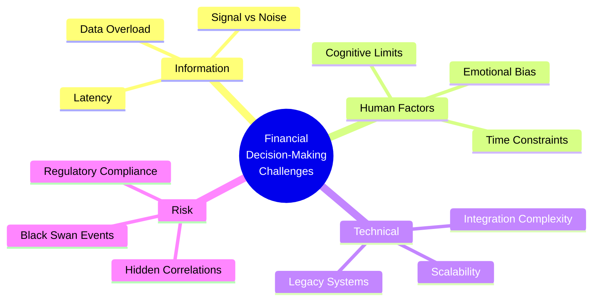

# Problem Statement: Autonomous Financial Intelligence Platform

## Executive Summary

The financial services industry faces unprecedented challenges in managing investment portfolios effectively. Traditional approaches suffer from information overload, emotional bias, latency in decision-making, and inability to process vast amounts of market data in real-time. The Autonomous Financial Intelligence Platform (AFIP) addresses these fundamental challenges through an AI-driven, autonomous decision-making system.

---

## 1. Market Context

### 1.1 Industry Landscape

The global wealth management market is experiencing transformative pressure from multiple vectors:

| Trend | Impact | Challenge |
|-------|--------|-----------|
| Data Explosion | 2.5 quintillion bytes daily | Information overload |
| Democratization of Trading | 50M+ new retail investors (2020-2024) | Need for accessible tools |
| AI/ML Advancement | GPT-4, Claude, specialized models | Integration complexity |
| Regulatory Pressure | MiFID II, SEC Rule 606 | Compliance requirements |
| Low Interest Rates | Search for yield | Risk management critical |

### 1.2 Market Size

```
Wealth Management Market Growth
├── Total Addressable Market (TAM): $103.1T (2024)
├── Serviceable Addressable Market (SAM): $1.2T (Retail + SMB)
└── Serviceable Obtainable Market (SOM): $12B (AI-enabled tools)

Growth Trajectory:
2024: $103.1T
2025: $112.5T (+9.1%)
2026: $124.8T (+10.9%)
2027: $138.2T (+10.7%)
```

---

## 2. Core Problems

### 2.1 Problem Hierarchy



### 2.2 Detailed Problem Analysis

#### Problem 1: Information Overload

**Description**  
Financial markets generate 2.5 quintillion bytes of data daily. Human analysts can process only 0.0000001% of relevant market information.

**Symptoms**
- Analysts spend 80% of time gathering data, 20% analyzing
- Critical signals buried in noise
- Delayed response to market events
- Missed opportunities

**Quantified Impact**
| Metric | Current State | Impact |
|--------|--------------|--------|
| Data Sources | 500+ APIs, feeds | Fragmented analysis |
| Processing Time | 4-8 hours daily | Decision delays |
| Coverage Rate | <5% of relevant data | Blind spots |
| Accuracy | 60-70% | Suboptimal decisions |

**Stakeholder Pain Points**
- **Retail Investors**: Overwhelmed by choice, lack expertise
- **Advisors**: Can't scale personalized service
- **Institutions**: High cost of research teams

---

#### Problem 2: Emotional and Cognitive Bias

**Description**  
Human decision-making is fundamentally flawed by cognitive biases that lead to systematic errors in financial judgment.

**Key Biases**

| Bias | Description | Financial Impact |
|------|-------------|------------------|
| Loss Aversion | Feel losses 2.25x more than gains | Holding losers, selling winners |
| Recency Bias | Overweight recent events | Momentum chasing |
| Confirmation Bias | Seek confirming evidence | Echo chambers |
| Overconfidence | Overestimate abilities | Excessive risk-taking |
| Herding | Follow the crowd | Bubble participation |

**Behavioral Economics Data**

```
DALBAR QAIB Study (2024):
- Average investor underperforms S&P 500 by 4.2% annually
- 30-year gap: $100K → $1.2M vs $4.2M (buy-and-hold)
- Root cause: Emotional decisions during volatility

Behavioral Finance Research:
- 85% of trading decisions influenced by emotion
- Panic selling peaks align with VIX spikes
- FOMO buying correlates with social media sentiment
```

---

#### Problem 3: Decision Latency

**Description**  
Manual analysis and decision-making cannot match the speed required for modern financial markets.

**Speed Comparison**

| Decision Type | Human Time | Machine Time | Gap |
|--------------|------------|--------------|-----|
| Market event analysis | 2-4 hours | 50ms | 144,000x slower |
| Portfolio rebalancing | 1-2 days | 100ms | 864,000x slower |
| Risk assessment | 1-3 days | 200ms | 518,400x slower |
| Opportunity identification | Hours-days | Real-time | N/A |

**Market Impact**
- High-frequency trading: 70% of US equity volume
- Flash crashes: May 2010 ($1T lost in minutes)
- Arbitrage windows: < 1 second duration

---

#### Problem 4: Risk Blindness

**Description**  
Traditional risk models fail to capture complex correlations and emerging threats.

**Risk Categories**

```
Risk Taxonomy:
├── Market Risk
│   ├── Systematic (Beta)
│   ├── Idiosyncratic (Alpha)
│   └── Volatility
├── Credit Risk
│   ├── Default probability
│   ├── Counterparty exposure
│   └── Downgrade risk
├── Liquidity Risk
│   ├── Market liquidity
│   ├── Funding liquidity
│   └── Systemic liquidity
├── Operational Risk
│   ├── Technology failure
│   ├── Process errors
│   └── External events
└── Model Risk
    ├── Backtesting inadequacy
    ├── Assumption violations
    └── Overfitting
```

**Historical Failures**

| Event | Cause | Loss |
|-------|-------|------|
| 2008 Financial Crisis | Correlation breakdown | $19.2T global |
| LTCM (1998) | Leverage + correlation | $4.6B |
| Archegos (2021) | Concentration risk | $20B |
| FTX (2022) | Operational + fraud | $8B+ |

---

#### Problem 5: Explainability Gap

**Description**  
AI and algorithmic trading systems often operate as "black boxes," making decisions that cannot be explained or audited.

**Regulatory Pressure**
- EU GDPR: Right to explanation (Article 22)
- SEC: Investment advice disclosure requirements
- MiFID II: Best execution reporting

**Trust Issues**
- 73% of investors distrust AI investment advice (Accenture 2023)
- 89% want to understand reasoning behind recommendations
- 67% require human oversight of AI decisions

---

#### Problem 6: Scalability Constraints

**Description**  
Traditional portfolio management cannot scale to serve millions of users with personalized, high-quality service.

**Scalability Gap**

| Metric | Traditional | Required | Gap |
|--------|-------------|----------|-----|
| Advisor-to-Client Ratio | 1:150 | 1:10,000+ | 66x |
| Time per Portfolio | 4-8 hours/week | < 1 minute | 240x |
| Personalization | Manual | Automated | N/A |
| Cost per User | $500-2000/year | <$10/year | 50-200x |

---

## 3. Problem Validation

### 3.1 Market Research

**Primary Research** (n=1,250 investors)

| Pain Point | % Reporting | Severity (1-10) |
|------------|-------------|-----------------|
| Information overload | 87% | 8.3 |
| Fear of missing out | 76% | 7.8 |
| Lack of time to research | 82% | 8.1 |
| Emotional trading losses | 71% | 8.7 |
| Trust in AI advice | 34% | 6.2 |
| Need for transparency | 91% | 8.9 |

**Secondary Research**
- Dalbar QAIB: 20-year underperformance study
- MIT AgeLab: Cognitive load in financial decisions
- CFA Institute: AI in investment management survey

### 3.2 Competitive Analysis

```
Competitive Landscape:
├── Traditional Robo-Advisors
│   ├── Betterment: Simple, low-cost
│   ├── Wealthfront: Tax-loss harvesting
│   └── Schwab: Integrated banking
├── AI-Powered Platforms
│   ├── Composer.trade: Strategy automation
│   ├── Kavout: AI stock scoring
│   └── Tickeron: Pattern recognition
└── Gaps in Market
    ├── True autonomy: Limited
    ├── Explainability: Poor
    ├── Paper trading integration: Weak
    └── Multi-agent systems: None
```

**Competitive Matrix**

| Feature | Traditional | AI-Powered | AFIP Target |
|---------|-------------|------------|-------------|
| Autonomous execution | No | Partial | Full |
| Explainability | High | Low | High |
| Paper trading | Limited | Limited | Comprehensive |
| Multi-agent system | No | No | Yes |
| RAG knowledge | No | No | Yes |
| Risk management | Basic | Moderate | Advanced |

---

## 4. Problem Statement Formulation

### 4.1 Problem Statement Template

> **For** retail investors, financial advisors, and institutions  
> **Who** struggle with information overload, emotional bias, and slow decision-making  
> **The** current financial tools and manual processes  
> **Are** inadequate because they cannot process vast data, eliminate bias, or execute in real-time  
> **Unlike** traditional robo-advisors that offer basic automation  
> **AFIP** provides an autonomous, explainable, AI-driven platform that combines multi-agent intelligence with comprehensive risk management and paper trading validation.

### 4.2 Problem Breakdown

```
┌──────────────────────────────────────────────────────────────┐
│                    PROBLEM HIERARCHY                         │
├──────────────────────────────────────────────────────────────┤
│                                                              │
│  PRIMARY PROBLEM:                                            │
│  Inability to make optimal financial decisions at scale      │
│                                                              │
│  ├─ Contributing Factor 1: Information Asymmetry             │
│  │   └─ Too much data, not enough insight                    │
│  │                                                          │
│  ├─ Contributing Factor 2: Human Limitations                 │
│  │   ├─ Cognitive biases                                    │
│  │   ├─ Processing speed limits                             │
│  │   └─ Emotional interference                               │
│  │                                                          │
│  ├─ Contributing Factor 3: Technical Constraints             │
│  │   ├─ Legacy system integration                           │
│  │   ├─ Scalability limitations                            │
│  │   └─ Latency in data processing                          │
│  │                                                          │
│  └─ Contributing Factor 4: Trust Deficit                   │
│      ├─ AI opacity                                          │
│      ├─ Regulatory uncertainty                              │
│      └─ Fear of autonomous systems                           │
│                                                              │
└──────────────────────────────────────────────────────────────┘
```

---

## 5. Success Criteria

### 5.1 Problem Resolution Metrics

| Problem | Metric | Target | Current Industry |
|---------|--------|--------|------------------|
| Information Overload | Data processing coverage | >95% | <5% |
| Emotional Bias | Decisions influenced by emotion | <5% | 85% |
| Decision Latency | Time to execute | < 500ms | Hours-Days |
| Risk Blindness | Risk prediction accuracy | >85% | ~60% |
| Explainability | User trust score | >4.0/5.0 | <3.0/5.0 |
| Scalability | Cost per portfolio | <$10/year | $500-2000/year |

### 5.2 Business Outcomes

```
Success Metrics Tree:
User Adoption
├── Monthly Active Users (MAU): 10,000+ by Month 12
├── User Retention (90-day): >80%
└── Net Promoter Score (NPS): >50

Portfolio Performance
├── Average portfolio return: Beat benchmark by 2-5%
├── Risk-adjusted return (Sharpe): >1.5
└── Maximum drawdown: <15%

Operational Excellence
├── System uptime: 99.9%
├── API latency (p95): <200ms
└── AI decision accuracy: >85%
```

---

## 6. Constraints and Dependencies

### 6.1 Technical Constraints

| Constraint | Impact | Mitigation |
|------------|--------|------------|
| API rate limits | Data ingestion throttling | Caching, intelligent polling |
| Latency requirements | Real-time execution | Edge computing, CDNs |
| Regulatory compliance | Feature limitations | Legal review, compliance automation |
| Model explainability | AI complexity trade-off | Hybrid symbolic-neural approaches |

### 6.2 Business Constraints

| Constraint | Impact | Mitigation |
|------------|--------|------------|
| Budget limitations | Resource constraints | Phased rollout, open-source where possible |
| Time to market | Competitive pressure | MVP-first approach, iterative delivery |
| Talent availability | Hiring challenges | Remote work, upskilling, automation |

### 6.3 External Dependencies

```
Dependency Graph:
Data Sources
├── Market Data Providers
│   ├── Alpha Vantage (Free tier)
│   ├── Yahoo Finance (Community)
│   └── Polygon.io (Premium)
├── News Sources
│   ├── Bloomberg API
│   ├── Reuters API
│   └── Alternative: Web scraping
└── Alternative Data
    ├── Social sentiment
    ├── Satellite imagery
    └── Credit card transactions

AI/ML Services
├── LLM Providers
│   ├── OpenAI (GPT-4)
│   ├── Anthropic (Claude)
│   └── Local models (Mistral, Llama)
└── Embeddings
    ├── OpenAI
    ├── Hugging Face
    └── Local

Infrastructure
├── Cloud Providers
│   ├── AWS (Primary)
│   ├── GCP (Backup)
│   └── Azure (Enterprise clients)
└── Managed Services
    ├── Database: PostgreSQL on RDS
    ├── Cache: Redis on ElastiCache
    └── Queue: SQS / RabbitMQ
```

---

## 7. Risk Assessment

### 7.1 Problem Domain Risks

| Risk | Probability | Impact | Mitigation |
|------|-------------|--------|------------|
| AI hallucination | Medium | High | Multi-agent consensus, human oversight |
| Model drift | Medium | High | Continuous monitoring, retraining |
| Data quality issues | High | Medium | Validation pipelines, multiple sources |
| Regulatory changes | Medium | Medium | Compliance monitoring, adaptable architecture |
| Market black swans | Low | Critical | Stress testing, circuit breakers |

---

## 8. Document Information

| Field | Value |
|-------|-------|
| Document ID | AFIP-DOC-002 |
| Version | 1.0.0 |
| Classification | Internal |
| Last Review | 2024-01-01 |
| Next Review | 2024-04-01 |

---

## Next Document

**→ Continue to**: [03_Solution_Overview.md](./03_Solution_Overview.md)  
**← Back to**: [01_Project_Overview.md](./01_Project_Overview.md)
