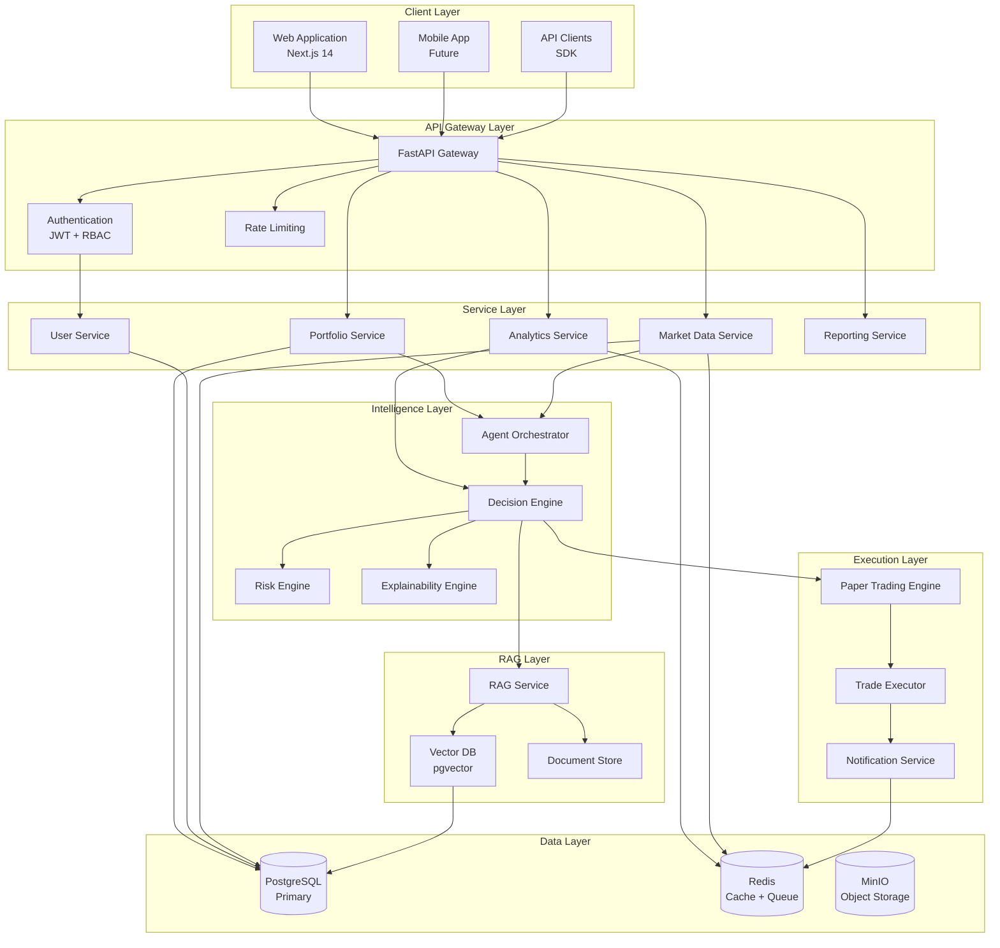

# System Architecture: Autonomous Financial Intelligence Platform

## Executive Summary

This document defines the comprehensive system architecture for AFIP, detailing component interactions, data flows, deployment patterns, and design decisions. The architecture follows a **layered microservices approach** with clear separation of concerns, enabling independent scaling, deployment, and maintenance of each component.

---

## 1. Architecture Overview

### 1.1 Architectural Style

**Pattern**: Layered Microservices with Event-Driven Components

```
Architecture Characteristics:
├── Modularity: Components are independently deployable
├── Scalability: Horizontal scaling at all layers
├── Resilience: Circuit breakers, retries, graceful degradation
├── Observability: Comprehensive logging, metrics, tracing
├── Security: Defense in depth, zero-trust principles
└── Maintainability: Clear contracts, versioned APIs
```

### 1.2 High-Level System Diagram



---

## 2. Layer Architecture

### 2.1 Client Layer

**Responsibility**: User-facing interfaces

| Component | Technology | Purpose |
|-----------|-----------|---------|
| Web Application | Next.js 14, React 18 | Primary user interface |
| Mobile Application | React Native (Future) | iOS/Android apps |
| API Clients | Python/JS SDK | Third-party integrations |

**Design Decisions**:
- **Next.js App Router**: Server-side rendering for SEO and performance
- **React Query**: Efficient data fetching with caching
- **TypeScript**: Type safety across frontend and API contracts

### 2.2 API Gateway Layer

**Responsibility**: Request routing, authentication, rate limiting

```python
# Gateway Configuration Pattern
class APIRouter:
    """
    Central routing configuration for all API endpoints.
    Implements consistent patterns for:
    - Authentication
    - Rate limiting
    - Request/Response transformation
    - Error handling
    """
```

**Components**:
| Component | Function |
|-----------|----------|
| Request Router | Routes requests to appropriate services |
| JWT Authentication | Validates access tokens, extracts user context |
| Rate Limiter | Prevents abuse with per-user limits |
| CORS Handler | Manages cross-origin requests |
| Request Validator | Validates input schemas |

**Rate Limiting Strategy**:
```yaml
Tiers:
  Free:
    requests_per_minute: 60
    requests_per_hour: 1000
  Pro:
    requests_per_minute: 300
    requests_per_hour: 10000
  Enterprise:
    requests_per_minute: 1000
    requests_per_hour: 50000
```

### 2.3 Service Layer

**Responsibility**: Business logic and domain operations

```
Service Architecture:

┌─────────────────────────────────────────────────────┐
│                 Service Pattern                     │
├─────────────────────────────────────────────────────┤
│                                                     │
│  ┌───────────────────────────────────────────────┐   │
│  │              Service Interface                │   │
│  │  • Input validation (Pydantic schemas)     │   │
│  │  • Authorization checks                     │   │
│  │  • Rate limiting                           │   │
│  └─────────────────────┬─────────────────────────┘   │
│                        │                            │
│  ┌─────────────────────▼─────────────────────────┐   │
│  │              Business Logic                  │   │
│  │  • Domain operations                        │   │
│  │  • Business rules                           │   │
│  │  • State transitions                        │   │
│  └─────────────────────┬─────────────────────────┘   │
│                        │                            │
│  ┌─────────────────────▼─────────────────────────┐   │
│  │              Data Access Layer                 │   │
│  │  • Repository pattern                        │   │
│  │  • Transaction management                     │   │
│  │  • Caching layer                            │   │
│  └───────────────────────────────────────────────┘   │
│                                                     │
└─────────────────────────────────────────────────────┘
```

**Service Catalog**:

| Service | Responsibility | Database Tables |
|---------|---------------|-----------------|
| User Service | Authentication, profiles | users, sessions, permissions |
| Portfolio Service | Portfolio CRUD | portfolios, assets |
| Transaction Service | Trade execution | transactions, orders |
| Analytics Service | Performance metrics | analytics, metrics |
| Market Data Service | Price feeds | prices, market_events |
| Reporting Service | Document generation | reports, exports |

### 2.4 Intelligence Layer

**Responsibility**: AI-driven analysis and decision-making

```
Intelligence Architecture:

┌─────────────────────────────────────────────────────┐
│              Agent Orchestrator                     │
├─────────────────────────────────────────────────────┤
│  • Manages agent lifecycle                          │
│  • Routes tasks to specialized agents               │
│  • Coordinates multi-agent workflows               │
│  • Handles agent communication                    │
└─────────────────────┬───────────────────────────────┘
                      │
         ┌────────────┼────────────┐
         │            │            │
┌────────▼──┐ ┌──────▼────┐ ┌─────▼─────┐
│  Analysis │ │  Research │ │   Risk    │
│   Agent   │ │   Agent   │ │   Agent   │
└───────────┘ └───────────┘ └───────────┘
         │            │            │
         └────────────┼────────────┘
                      │
         ┌────────────▼────────────┐
         │      Decision Engine     │
         │  • Evaluates options      │
         │  • Confidence scoring     │
         │  • Selects action         │
         └────────────┬────────────┘
                      │
         ┌────────────▼────────────┐
         │   Explainability Engine  │
         │  • Reasoning traces       │
         │  • Confidence metrics     │
         │  • Audit trails           │
         └───────────────────────────┘
```

### 2.5 RAG Layer

**Responsibility**: Context-aware knowledge retrieval

```
RAG Pipeline:

Ingestion Flow:
┌─────────┐    ┌─────────┐    ┌─────────┐    ┌─────────┐
│ Documents│───>│ Chunker │───>│Embedder │───>│ Vector  │
│ (PDFs,  │    │         │    │         │    │  DB     │
│  News)  │    │         │    │         │    │         │
└─────────┘    └─────────┘    └─────────┘    └─────────┘

Retrieval Flow:
User Query ──> Query Embedding ──> Vector Search ──> Reranking ──> Context
                                  (Top-K)         (Cross-encoder)

Generation Flow:
Context + Query ──> LLM ──> Response ──> Citations
```

**Components**:
| Component | Technology | Purpose |
|-----------|-----------|---------|
| Chunking Service | LangChain | Document segmentation |
| Embedding Model | HuggingFace/all-MiniLM | Vector representation |
| Vector Database | pgvector | Similarity search |
| Reranker | Cross-encoder | Precision ranking |
| LLM | GPT-4 / Claude / Local | Response generation |

### 2.6 Execution Layer

**Responsibility**: Trade simulation and execution

```
Execution Flow:

Decision
   │
   ▼
┌──────────────────┐
│ Risk Validation  │──> Reject if exceeds risk limits
└────────┬─────────┘
         │
         ▼
┌──────────────────┐
│ Paper Trading    │──> Simulate if paper mode enabled
└────────┬─────────┘
         │
         ▼
┌──────────────────┐
│ User Approval    │──> Human-in-the-loop check
└────────┬─────────┘
         │
         ▼
┌──────────────────┐
│ Live Execution   │──> Execute via broker API
└────────┬─────────┘
         │
         ▼
┌──────────────────┐
│ Confirmation     │──> Log transaction, notify user
└──────────────────┘
```

### 2.7 Data Layer

**Responsibility**: Persistent storage and caching

```
Data Architecture:

┌─────────────────────────────────────────────────────────┐
│                    Data Layer                           │
├─────────────────────────────────────────────────────────┤
│                                                         │
│  Primary Storage          Caching           Queue       │
│  ┌──────────────┐       ┌──────────┐    ┌──────────┐   │
│  │ PostgreSQL   │<─────>│  Redis   │    │  Redis   │   │
│  │ (OLTP)       │       │ (Cache)  │    │ (Queue)  │   │
│  └──────────────┘       └──────────┘    └──────────┘   │
│                                                         │
│  Object Storage         Time-Series        Search       │
│  ┌──────────────┐       ┌──────────┐    ┌──────────┐   │
│  │ MinIO/S3     │       │ClickHouse│    │ pgvector │   │
│  │ (Files)      │       │(Future)  │    │ (Vector) │   │
│  └──────────────┘       └──────────┘    └──────────┘   │
│                                                         │
└─────────────────────────────────────────────────────────┘
```

---

## 3. Communication Patterns

### 3.1 Inter-Service Communication

| Pattern | Use Case | Implementation |
|---------|----------|----------------|
| **Synchronous HTTP** | CRUD operations, queries | FastAPI + httpx |
| **Asynchronous Messaging** | Events, background tasks | Redis + Celery |
| **WebSocket** | Real-time updates | FastAPI WebSockets |
| **gRPC** | Internal high-performance (Future) | protobuf |

### 3.2 Event-Driven Architecture

```
Event Flow:

┌──────────┐    ┌──────────┐    ┌──────────┐
│ Producer │───>│  Redis   │───>│ Consumer │
│          │    │  Pub/Sub │    │          │
└──────────┘    └──────────┘    └──────────┘

Event Types:
├── portfolio.created
├── portfolio.updated
├── transaction.executed
├── price.updated
├── alert.triggered
├── decision.made
└── report.generated
```

---

## 4. Security Architecture

### 4.1 Security Layers

```
Security Architecture:

┌─────────────────────────────────────────────┐
│         Layer 4: Application Security       │
│  • Input validation                        │
│  • Output encoding                         │
│  • CSRF protection                         │
└─────────────────────────────────────────────┘
                    │
┌─────────────────────────────────────────────┐
│         Layer 3: API Security               │
│  • JWT authentication                      │
│  • Rate limiting                           │
│  • API versioning                          │
└─────────────────────────────────────────────┘
                    │
┌─────────────────────────────────────────────┐
│         Layer 2: Transport Security         │
│  • TLS 1.3 encryption                      │
│  • Certificate pinning                     │
│  • Secure headers                          │
└─────────────────────────────────────────────┘
                    │
┌─────────────────────────────────────────────┐
│         Layer 1: Infrastructure Security    │
│  • Network isolation                       │
│  • Secrets management                      │
│  • Vulnerability scanning                  │
└─────────────────────────────────────────────┘
```

### 4.2 Authentication Flow

```
Authentication Sequence:

┌──────┐                                    ┌──────────┐
│ User │                                    │ Backend  │
└──┬───┘                                    └────┬─────┘
   │                                             │
   │ 1. POST /auth/login                         │
   │ {email, password}                            │
   │────────────────────────────────────────────>│
   │                                             │
   │                                             │ 2. Validate credentials
   │                                             │    against DB
   │                                             │
   │ 3. Generate JWT                           │
   │    + Refresh Token                          │
   │<────────────────────────────────────────────│
   │                                             │
   │ 4. Store tokens securely                     │
   │    (HttpOnly cookies)                       │
   │                                             │
   │ 5. Subsequent requests with                 │
   │    Authorization header                     │
   │────────────────────────────────────────────>│
   │                                             │
   │                                             │ 6. Verify JWT
   │                                             │    Extract user_id
   │                                             │
```

---

## 5. Scalability Design

### 5.1 Horizontal Scaling Strategy

```
Scaling Patterns:

Load Balancer
     │
     ├──> API Server 1 ──> Database Primary
     ├──> API Server 2 ──>     │
     ├──> API Server 3 ──>     ├──> Read Replica 1
     └──> API Server N ──>     └──> Read Replica 2

Worker Pattern:
┌─────────┐     ┌─────────┐     ┌─────────┐
│ Task    │────>│  Redis  │────>│ Worker  │
│ Queue   │     │ Queue   │     │ Pool    │
└─────────┘     └─────────┘     └─────────┘
                                    │
                              ┌─────┼─────┐
                              ▼     ▼     ▼
                           Worker Worker Worker
                           1      2      N
```

### 5.2 Caching Strategy

| Cache Type | TTL | Invalidation |
|------------|-----|--------------|
| User Session | 30 min | On logout |
| Market Data | 5 min | On new tick |
| Portfolio Summary | 1 min | On transaction |
| API Response | Varies | Cache-control headers |
| Static Assets | 1 year | Version-based |

---

## 6. Deployment Architecture

### 6.1 Container Strategy

```
Container Organization:

┌───────────────────────────────────────────────┐
│              Docker Compose                   │
├───────────────────────────────────────────────┤
│                                               │
│  ┌──────────────┐  ┌──────────────┐          │
│  │  Backend     │  │  Frontend    │          │
│  │  (Python)    │  │  (Node.js)   │          │
│  └──────────────┘  └──────────────┘          │
│                                               │
│  ┌──────────────┐  ┌──────────────┐          │
│  │  PostgreSQL  │  │    Redis     │          │
│  └──────────────┘  └──────────────┘          │
│                                               │
└───────────────────────────────────────────────┘
```

### 6.2 Production Deployment

```yaml
# Production (Kubernetes) - Future
Deployment:
  Backend:
    replicas: 3
    resources:
      cpu: 1000m
      memory: 2Gi
  Frontend:
    replicas: 2
    resources:
      cpu: 500m
      memory: 512Mi
  Workers:
    replicas: 5
    resources:
      cpu: 1000m
      memory: 2Gi
```

---

## 7. Monitoring and Observability

### 7.1 Observability Stack

```
Monitoring Architecture:

┌─────────────┐   ┌─────────────┐   ┌─────────────┐
│   Metrics   │   │    Logs     │   │   Traces    │
│             │   │             │   │             │
│ Prometheus  │   │  ELK Stack  │   │   Jaeger    │
│  + Grafana  │   │             │   │             │
└─────────────┘   └─────────────┘   └─────────────┘
```

### 7.2 Key Metrics

| Category | Metrics | Alert Threshold |
|----------|---------|-----------------|
| Performance | Response time p95 | > 500ms |
| Performance | Error rate | > 1% |
| Performance | Throughput | < 100 req/s |
| Resource | CPU utilization | > 80% |
| Resource | Memory usage | > 85% |
| Resource | Disk I/O | > 90% |
| Business | Failed trades | > 5% |

---

## 8. Document Information

| Field | Value |
|-------|-------|
| Document ID | AFIP-DOC-004 |
| Version | 1.0.0 |
| Status | Draft |
| Owner | Lead Architect |

---

## Next Document

**→ Continue to**: [05_AI_Agent_Architecture.md](./05_AI_Agent_Architecture.md)  
**← Back to**: [03_Solution_Overview.md](./03_Solution_Overview.md)
